#Excel and Tabelow is dead. Billionares data analysis on Exploratory, UI for R — Is Europe women-friendly work environments true ?

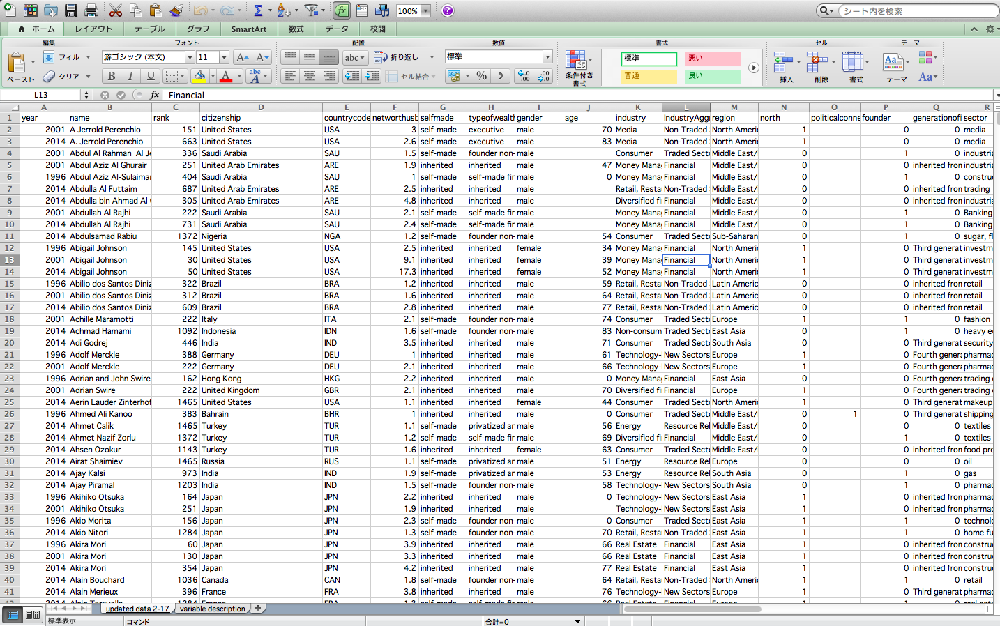

Do you have any idea about this spreed sheet data ? I don't think so.

Actually, this is billionares data all over the world which I downloaded from Forbes.com.

Anyway, From what country are there the most people in that billionares? How come they become billionares ? Which are there more of, men or women?

As some articles which I recently read like below, Europe seems countries which have women-friendly work environments. If it is true, Has Europe many women billionares?

Do, we have a product called Exploratory which can solve such some questions easily by analyzing data for you. I'm in the project's team in Silicon Valley. I'm grateful for being surrounded by great people who make me want to be better self everyday. Exploratory Desktop provides an interactive and reproducible real data wrangling and analysis experience powered by R and visualization. In terms of technology, Exploratory provides interactive and reproducible environments for analyzing data by using NW.js (desctop application SDK on WebKit) and plotly.js on frontend of R.

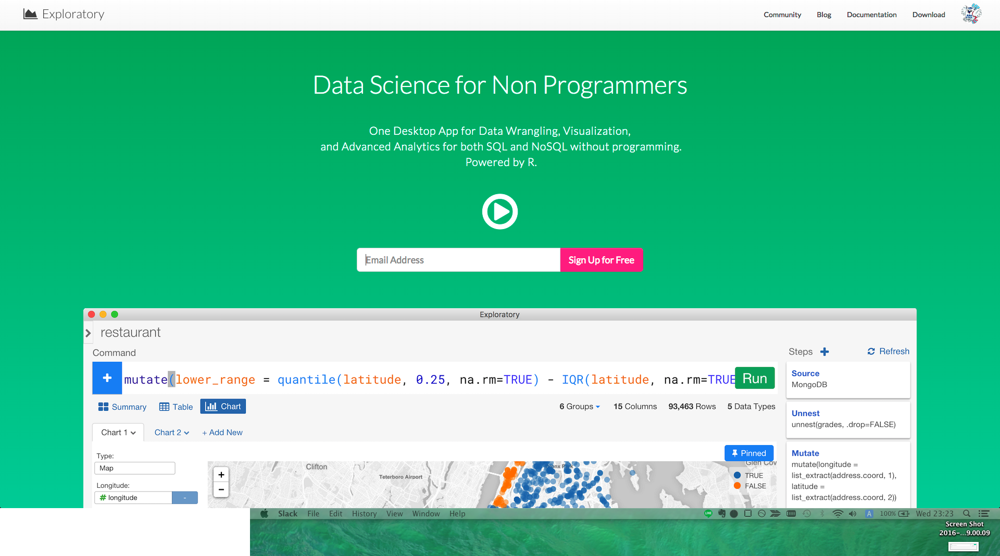

We released β version in May.

We excited that Hadley Wickham, the most famaous person in R , retweeted our release.

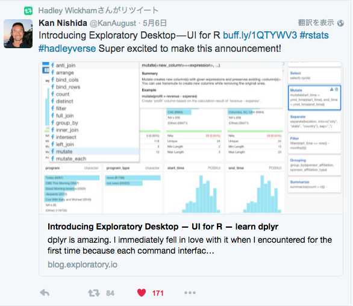

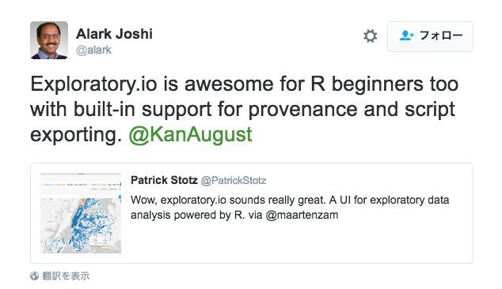

Here is many reactions around the world.

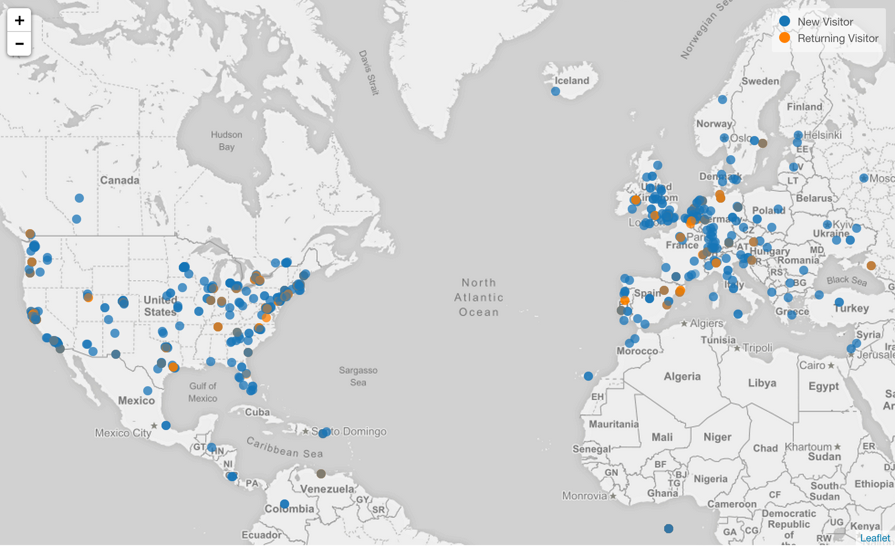

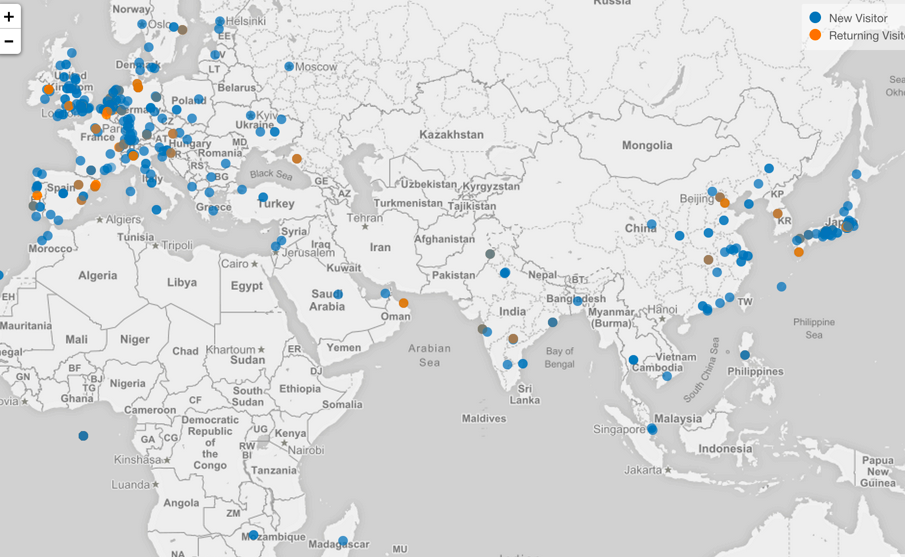

###Target Audience: Data Scientists who can do basic R or Python or People Who Know Just Enough R or SQL to Get by or Who are frustlating with Excel or Tabelow for analyzing data,

Before I begin, I’d like to clarify who my target audience is.In this tutorial, I’m targeting the third group I mentioned: people who know just enough jQuery to get by or Who is frustlating with Excel or Tabelow for analyzing data. Examples of people who might fit in this category would be:

- Data Scientists or Analyst who can do basic R or Python.
- Data Scientists or Analyst Who are frustlating with Excel or Tabelow.
- Beginning developers who have completed basic SQL tutorials online.
- Beginner who want to learn R but don't know how to learn for their reserch or static needs.
- Anyone who are interestead in gender problem like working environments.

Anyways, let’s get started!

###Time Estimate: 15 minutes

If you go really fast, this tutorial should take a bit over 10 minutes. If you go slow, it should take a bit over 15 minutes.

If you’re stuck
If you’re stuck, do any of the following:

- Comment on the comment box at the very bottom of this page.
- Email me at hidetaka.koh@gmail.com.
- Tweet me at [@SoccerKinki](https://twitter.com/SoccerKinki?lang=ja
)

##Overview: Has Europe many women billionares?

Let's reveal the question whether Europe women-friendly work environments is true or not by analyzing data for introduction of Exploratory. After that, I state my impressions of data which I analyzed.

- STEP 1: Prepare Project before analyze
- STEP 2: Caluculate ratio of billionares for each countries
- STEP 3: Remove outliers
- STEP 4: Is Europe women-friendly work environments true
- STEP 5: One more thing
- STEP 6: Share by publishing Note.

- Finally: My Observations

###STEP 1: Prepare Project Before Analyze

First of all, you can create projects from here.

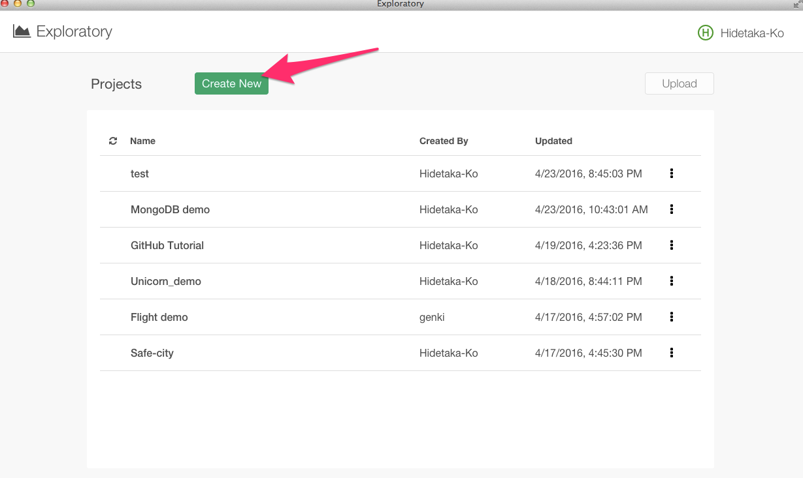

You can import data. Dataset is [here](https://www.dropbox.com/home?preview=Billionaires.xlsx). You can download.

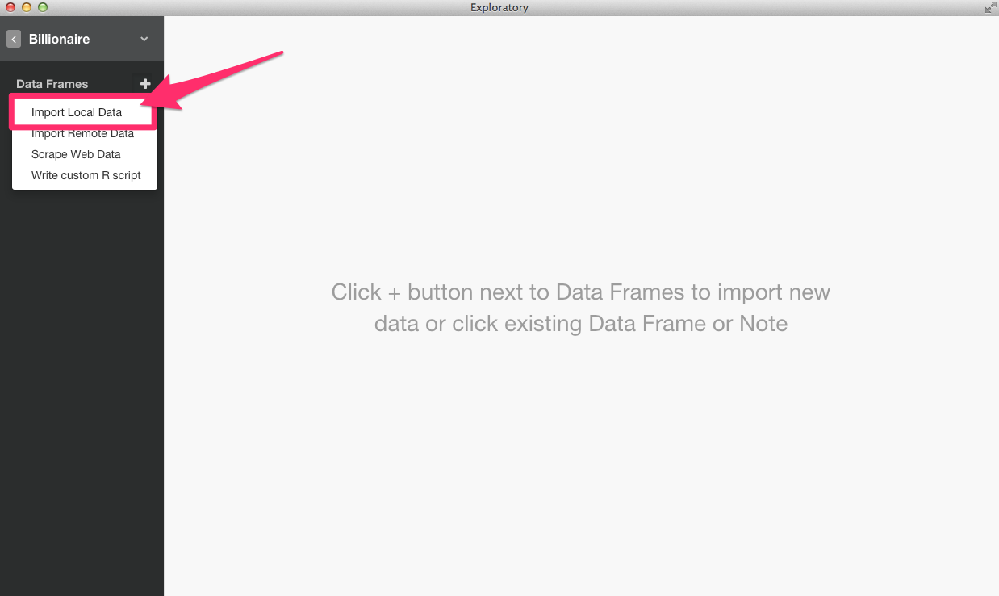

####Summary View

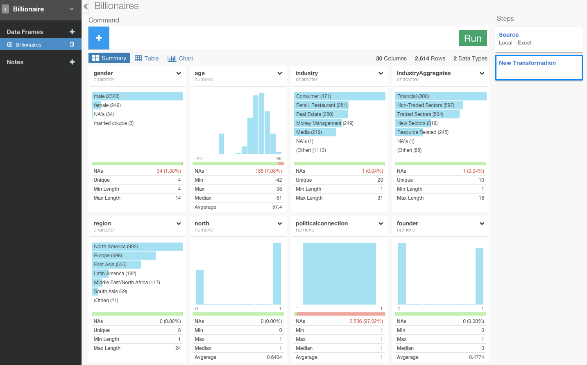

Totally diffrent,right ? Thanks to Summary View, we can easily overview data which we can't recozinize in Excel data by importing. For example, this citizenship column represents the number of billionaires for each countries. As you can see, United States have the most billionaire all over the world. This selfmade column represents how come they become billionares. When you see gender column, you can understand men's billionaires is much more than women at first glance.

But, we can't analyze data precisely with the way it is now.　Why not ?

Let's see year column and name column.

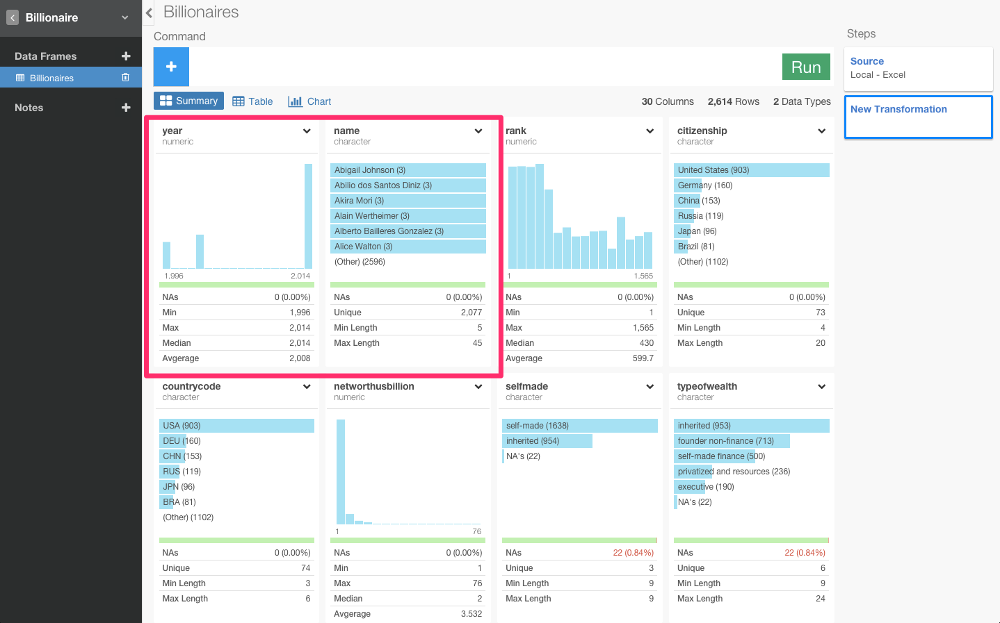

Year column has data of the three years, 2014 and 2000 and 1996.
次に、nameカラムを見てみると、例えば、Akira Moriさん（六本木の森ビルの人）の最後には、3となっていますね。これは、3回カウントされているということです。つまり、このデータにおいてAkira Moriさんは、2014年、2000年、1996年どの年度のときにも億万長者としてカウントされていたことを意味します。

What we want to know is imformation about billionaires in Europe now. Then, when same people like Bill Gates were count many time, we can't analyze data precisely. So, we need to delete other data except 2014's year.

In such case, in contrast to Excel which I need to find where function like filter are, Exploratory enables us to chose command from there or type code like SQL.

Moreover, You can simply select command from the column header dropdown list, which will generate a command like below.

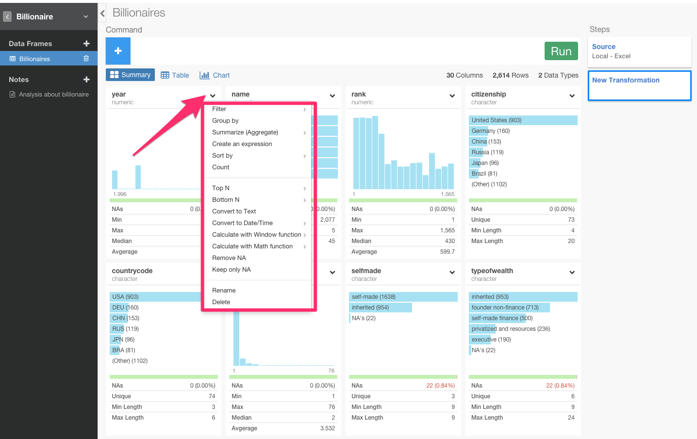

Let's select ‘Filter’ from the column header dropdown list, which will generate a command like below because we want to filtering 2014's data.

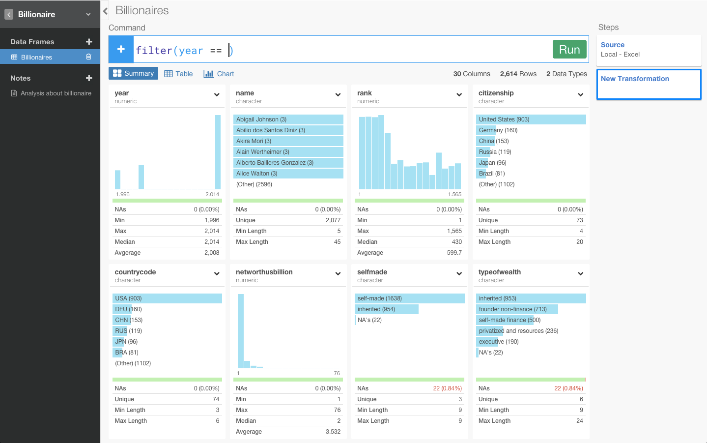

Let's specify that year is 2014 and press Run button.

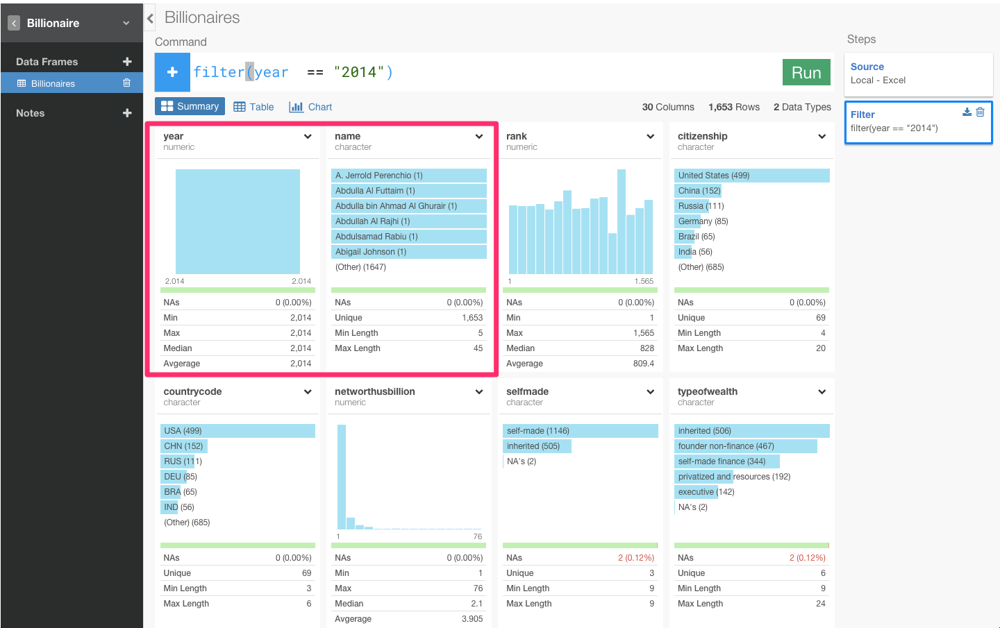

Then, we can see only 2014's data in Summary View and the number of name become 1 from 3.

In Chart View, we can intuitively understand data powered by visualization.

Let's assign X axis to citizenship and color axis to gender. That is because we want to see graph of gender for each countries. Blue color represents female and orange color represents male.

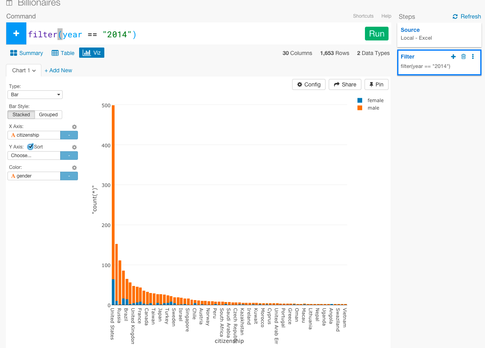

There are many billionaires and the ratio of men is overwhelmingly higher than the ratio of women in United States.By only this steps, Exploratory can make the chart so that we can understand data.

That is to say, Exploratory enable us to overview data easily and intuitively by just importing and realize mistake of data and fix it to analyze data.

###STEP 2: Caluculate the ratio of billionares for each countries

Note that to answer the question which is "Has Europe many women billionares?", we have another problem. We don't know the ratio of billionares between man and woman for each countries because the height of each bar is diffrent.

That's why, We want to caluculate the ratio of woman billionares for each countries.

At First, We can quickly see the data as table like Excel by going to Table view.

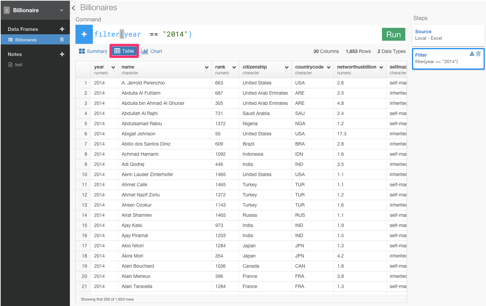

We can group citizenship and gender because we need to know the relationship between citizenship and gender by using 'group_by' command. You can construct this command from the column header menu like below. Click 'Group by' which will generate a command like below.

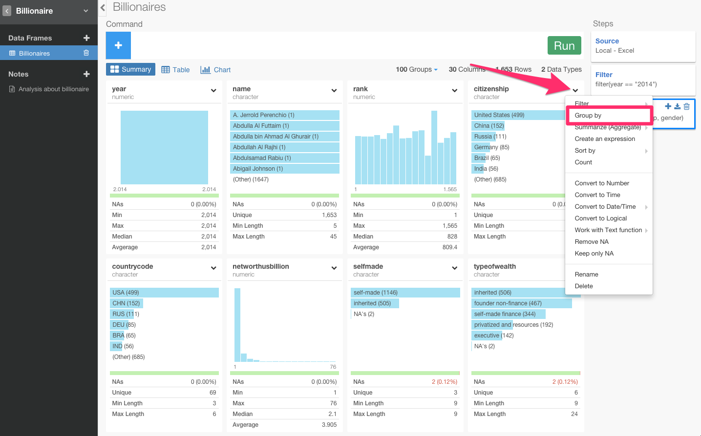

Add 'gender' separating them by comma. Here is the final command we want to run.

`group_by(citizenship, gender)`

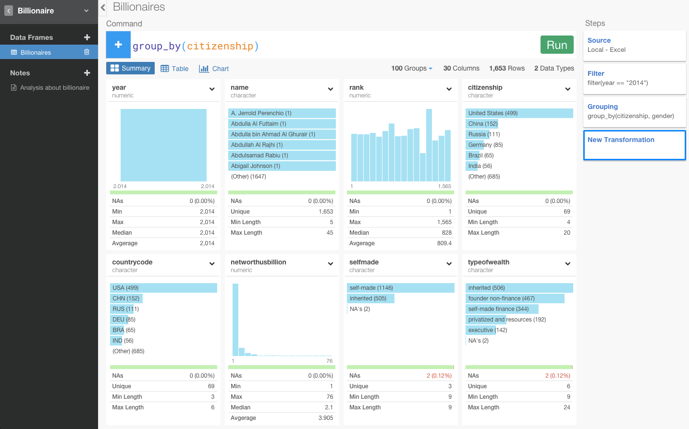

You can confirm that citizenship and gender was grouped like below.

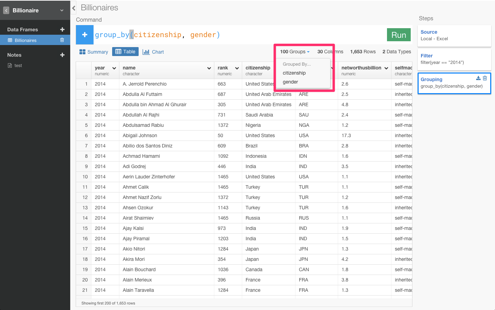

Anyway, We need to divide each of the number of men and women by the total of men and women to calculate the ratio. That's why we want to create a column called 'count' which represents each of the number of men and women for each country. You can create new column and aggregate the data by using 'summerize' command.

To make the command line interface work effectively and easier for anyone We have ‘Context aware syntax suggestion’ which recommend a set of list for function or column because Exploratory Desktop always check which column or function is good in this context like below.

So, you don't have to google the mean for functions which you don't know.

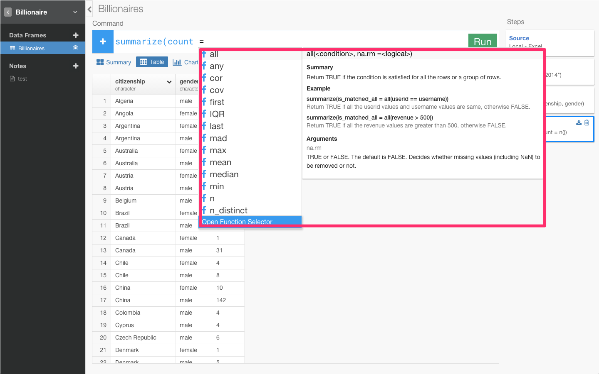

For example, here you will see a set of ‘aggregate’ functions that can be used in ‘summarize()’ command. If you are not familiar with R, as you can see, this ‘all’ function can be used to return TRUE if the condition is satisfied for all the rows or a group of rows. You can use mean function in case of average or sum function in case of total.

This ‘Context aware syntax suggestion’ is actually a pretty powerful feature in Exploratory Desktop, please take a look at [this post](https://blog.exploratory.io/context-aware-syntax-suggestion-d52519c55cf8#.n83k4wes0
) for the detail.

By the way, let's use 'n' function because we want to count in this case.

Look at Australia! They have 4 female and 25 male. To caluculate the ratio of woman, we need to divide 29 man and female by 4 female, don't we ? That's why let's make new column called total. To make new column, we can use 'mutate'. Why do I need to use 'mutate', not summerize like previous case in this case. I have an answer for you. The difference is when we aggregate many row in case of summerize and make new column with same row in case of mutate.

Let's 'mutate' commmand in this case because we want to left each row. And, we can use 'sum' function to caluculate total.

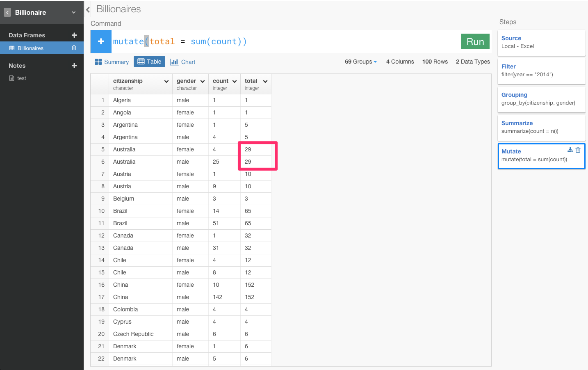

Let's create the ratio column because we can create total column. When we divide count column by total, we can caluculate the ratio.

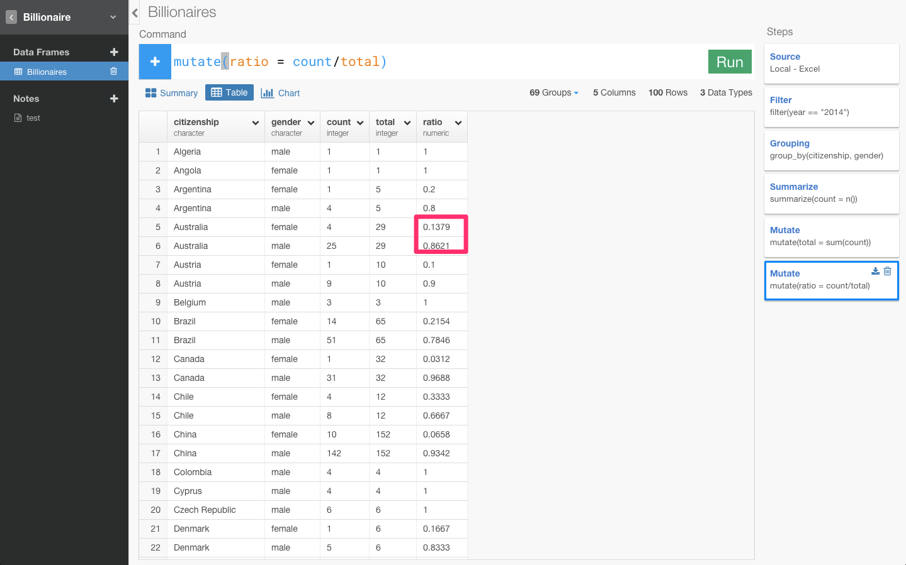

Let's make 100 times because of 0.1379 and 0.8621.

That's why we understand Men and women of the ratio of the billionaire in each of the country.

13% of Billionaires is women and 86% of Billionaires is Men in Australia.

###3. Remove outliers

Let's go to chart view to understand data more intuitively by visualization.

Let's assign citizenship to X-axis and ratio to Y-axis and gender to color-axis.

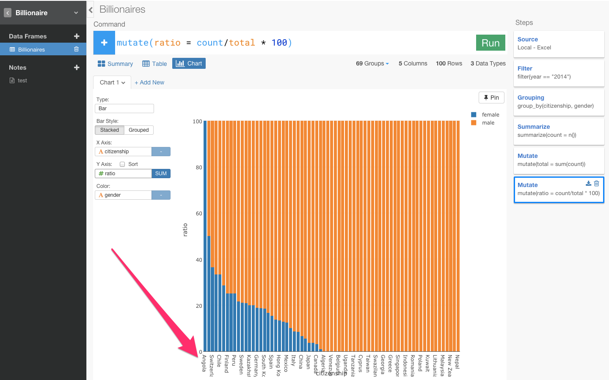

the highest female billionaire ratio is Angola as you can see.

Then, Do you say that Angola is country that have the highest female billionaire ratio all over the world ?

Let's go to Table view to understand situation.

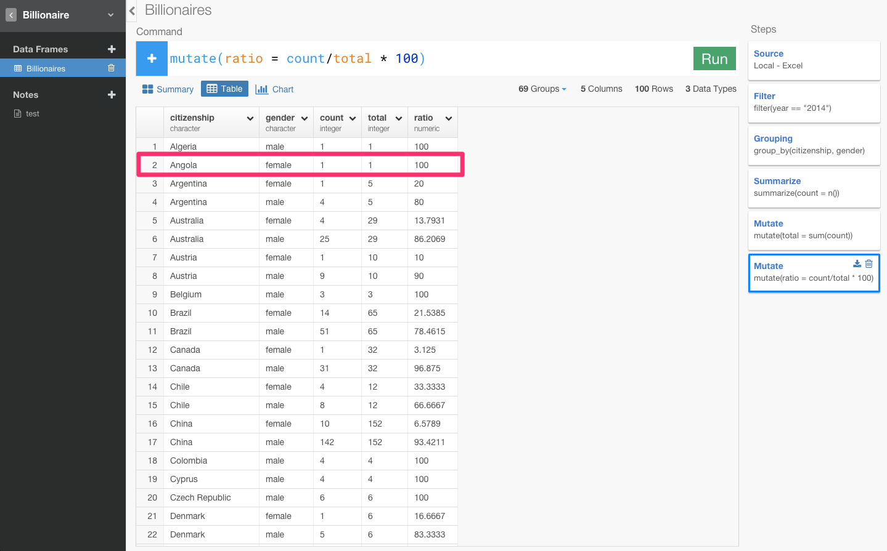

Total number of billionaires in Angola is only 1 and woman. In other words, There is not enough peripheral data because the number of population is too small. So, Let's filter the number of population.

There is only countries which have more than 5 the number of population like above.

###4. Conculsion: Is Europe women-friendly work environments true ?

Let's go to chart view to understand data more intuitively by visualization.

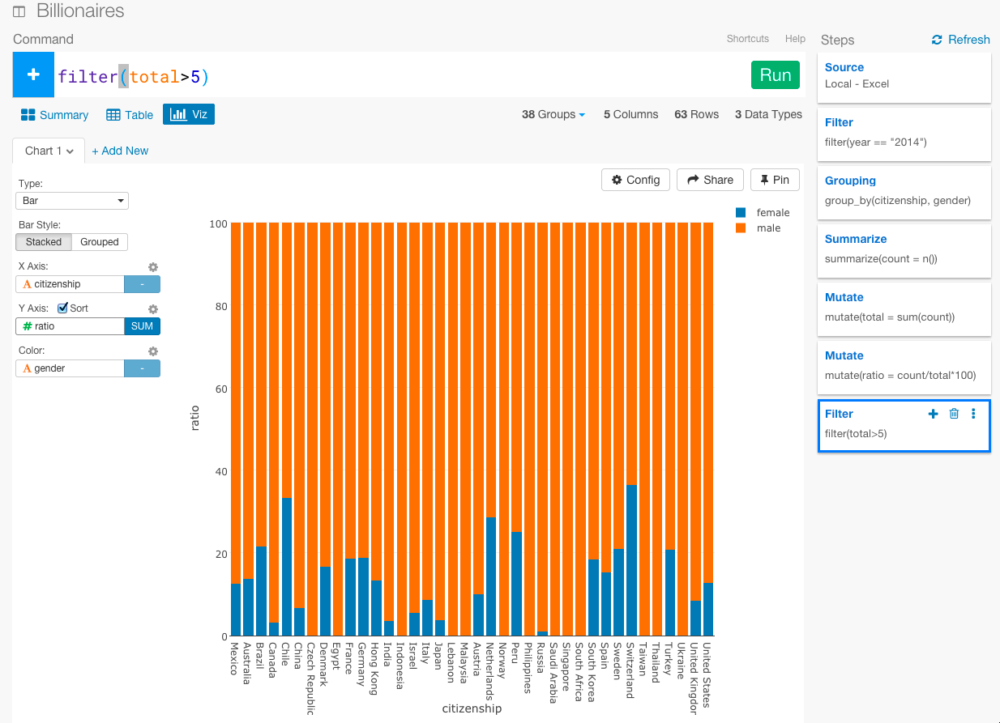

High female billionaire ratio countries are European like Chile, Switzerland, Holland, Peru, Germany, France, Denmark as you can see.

Do you remember selfmade column that means how come they become billionares as I told before ? By using this column, let's see the diffrence between by income and by myself. So, I want to come back Filter step which assigned year at first.

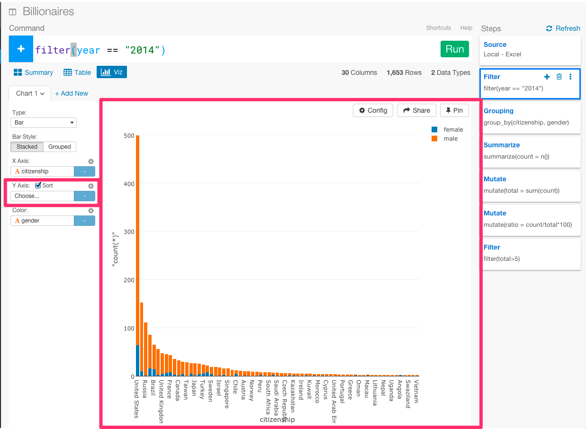

Oh... When I back to filter step, Ratio in Y-axis come off and chart is diffrent from previous one. That is because ratio column doesn't exist at the time of filter step which is blue. That's why Pin button is here for this problem.

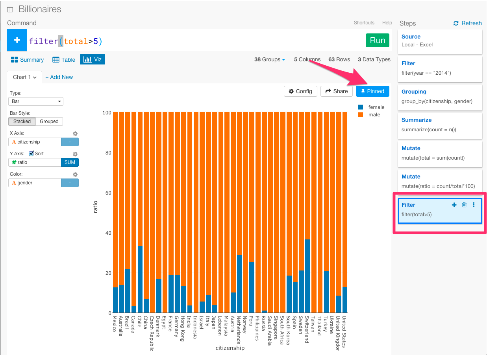

When you click the Pin button, the part which you filter in the last became blue. The chart is fixed to the last blue step. Then, When you come back to filter step in the first with this status, you can see like below.

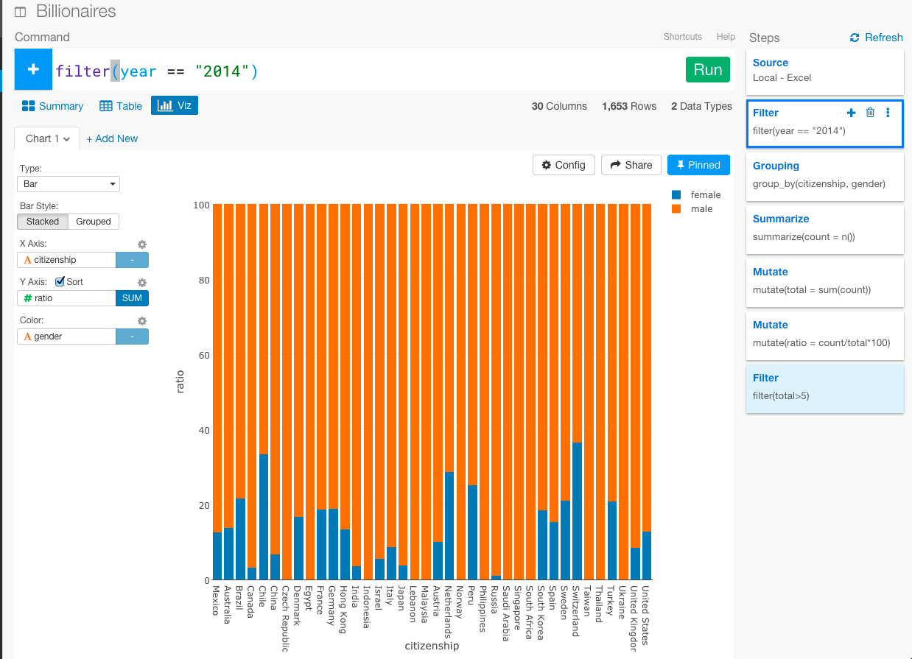

Although we change the step now, we can update the past step while fixxing the chart to this blue step because I Pin this step. Then, let's filter only billionares by income.

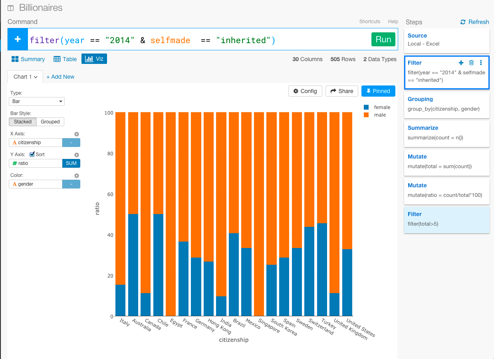

Women of billionaire many countries by income are European countries like Australia, Chile, France, Germany, Spain, Sweaden, Switzerland as you can see.

And, let's filter only billionares by selfmade.

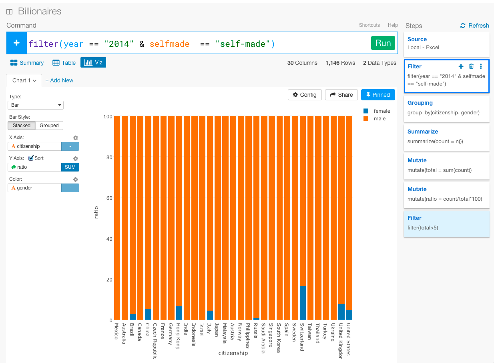

Wow! Many countries decrease suddenly. That is really interesting! Women of billionaire many countries by selfmade are only US and Switzerland. Many European countries like France and Geramany decrease now.

In conclusion, of course the number of woman of billionaire in Europe is many compared to other countries. But, this is critical thing, Many of women of billionaireis in Europe is by income. There are less of woman of billionaireis in Europe is by selfmade. That's why Europe women-friendly work environments is not necessary true.

##5. One more thing

This tutorial almost done. But, I want to show one more system for you. This is really interesting in term of technical point. And, you will understand why right step is.Although we can see the ratio per gender, in the next step, why don't see the ratio per industry ? Then, you can see by back to step for grouping and change just one command. So, let's go the step!

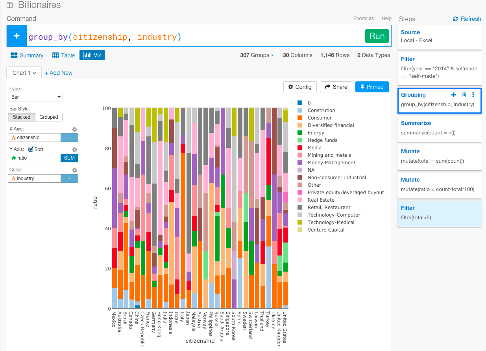

Although this chart is pinned to the last blue step, Exploratory can automatically caluculate and vizualize the data when you update grouping step.

##6. Sharing Chart in Reproducible and Collaborative Way

この発見を記録したり、シェアしたいと思いませんか？　Noteというボタンを押してみましょう。

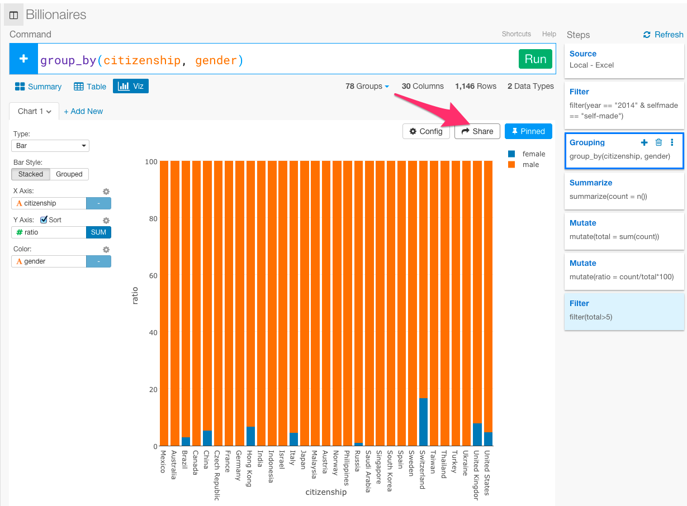

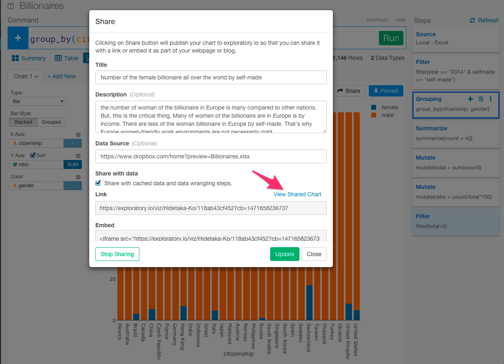
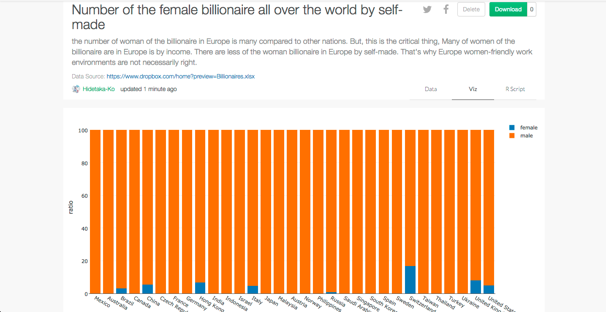

こんなふうにブログを書く感覚で簡単にデータ分析のレポートを書くことができます。データ分析するだけじゃなくて、他の仲間にも簡単にシェアすることもできます。

##Excel is dead. Why Exploratory is Exploratory?

この最初からの一連のステップをExcelですることを想像できるでしょうか？笑

The reason we at Exploratory get up every morning being excited is because we have a chance to address this decades old (if not hundreds) challenge that is slowing down our society to progress. We want Exploratory Desktop to be an environment where we can focus on analyzing the data, asking questions about the data, and wrangling with the data to explore possible answers, without much worrying about the processes or how to make it reproducible for later use. And of course, we want Exploratory Desktop to take care of making all the exploratory works reproducible behind the scene just in case we might need it later!

##7. Making the World Better for Working Women

留学先である、人材の流動性が高いシリコンバレーは実力主義のイメージが強いですが、仮にそうだとすると、次のデータはどう説明すればいいのでしょうか。[ソース](https://medium.com/diversify-tech/i-m-a-white-guy-in-silicon-valley-and-i-m-done-buying-the-meritocracy-myth-2cc0ef9f9b60#.lql629j9y)

1. シリコンバレーのトップ企業の管理職は78%が男性
2. エンジニアは85%が男性
3. 取締役レベルだと89%が男性
4. CEOレベルだと93%が男性
5. ベンチャー投資家だと96%が男性　

「シリコンバレー = 実力が全ての世界」とするのであれば、このデータからは「男性の実力 > 女性の実力」と結論付けるしかありません。だが実際には、シリコンバレーは男社会で(日本ほどではありませんが)、女性はキャリア面でハンデを負っています。

だから、ぼくの留学先であるシリコンバレーでは、女性エンジニアが少ないから、女性エンジニアを増やそうという動きが出てきています。ついこないだ、女性のコンピュータサイエンス教育によってジェンダーギャップを失くそうとしている[She++](http://www.sheplusplus.org/
)という団体がスタンフォード大学でカンファレンス的なのをしていたので見に行ったりしてました。They insisted “Maybe Womand don’t want to fall behind in their career when they’re pregnant. But She++ think learning to code is so much more practical. You can work remotely as a programmer too, while raising a kid.”

It’s challenging to be a working woman in Japan, my home country, too. The Economist recently presented their “glass-ceiling index,” which placed Japan among OECD countries with the largest gender gaps in their workplaces. For many Japanese women, returning to the workplace after having a child is often an insurmountable task. Japan should learn from She++, I think.

社会的に恵まれている人たちの中でも、実力主義を宗教のように信じている人たちは、実力の劣る人たちを見て「努力不足だ」と蔑むことはしても、男女の問題など、その後ろにある社会の不平等に気付かないことが多い気がします。完全な実力主義社会など存在しないことを、忘れてはいけません。

####FAQ

- 今回は、棒グラフしか使いませんでしたが、棒グラフ以外のグラフタイプもサポートしています。
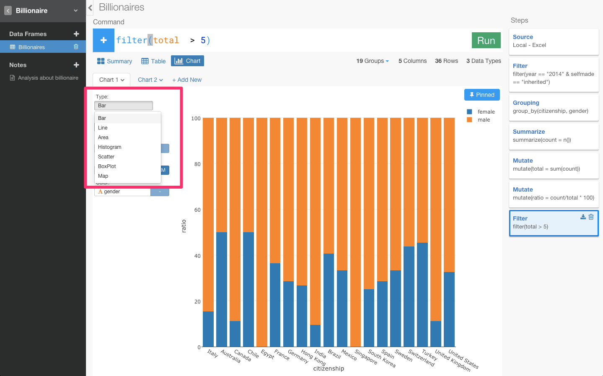

- 今回は、ローカルのファイルをインポートしてきて分析しましたが、以下のように、GitHub、Google Analytics、Google Spread sheet、Mongo DB、MySQL、JSON REST APIなどのたくさんのデータベースから本当に簡単にデータをインポートしてきて分析することも可能です。

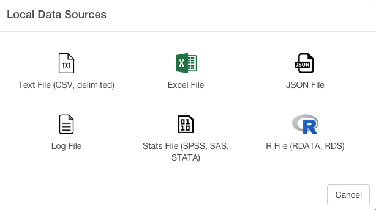

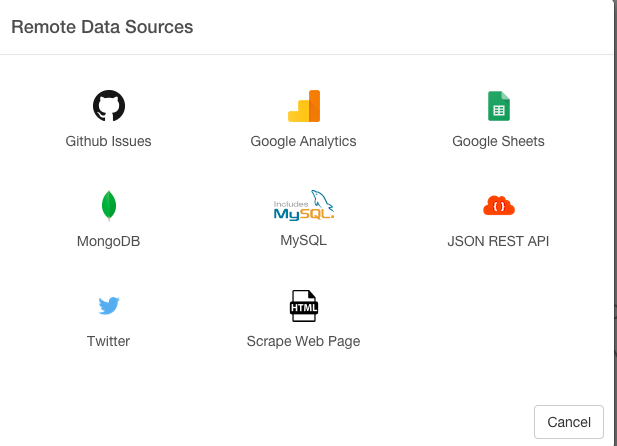

- 今回は使いませんでしたが、このソフトウェアはプログラミング言語「R」の上に開発されているので、使うコマンドや関数はRとほとんど同じになります。Rでできることは全てできます。Rは数学系のライブラリが充実しているので、クラスタリングやコホート分析や決定木分析などのような高度な統計や数学を応用してデータを分析していくことも可能です。

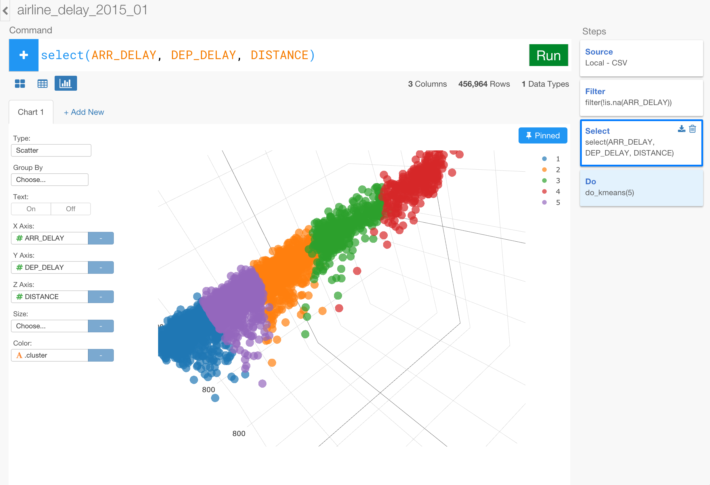

##Beta invitation is open

This is still our beta version and we’re just getting started. So there could be some places you might find unpolished, but we would love to hear what you think of it. You can sign up for the beta access from [this page](https://exploratory.io/
)

You can see our tutorial for Exploratory form [this page](http://docs.exploratory.io/tutorials/intro.html
)

[Introducing Exploratory Desktop — UI for R](https://blog.exploratory.io/introducing-exploratory-desktop-ui-for-r-895d94ef3b7b#.4dncgv1rt
) is good article, too!

Thanks for reading. I’d appreciate a click on the “Recommend” button at the end if you liked this article.

