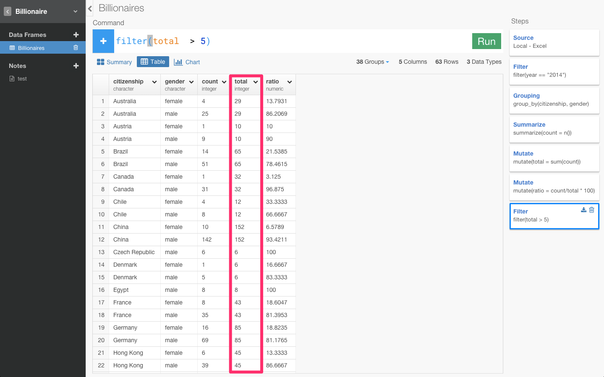
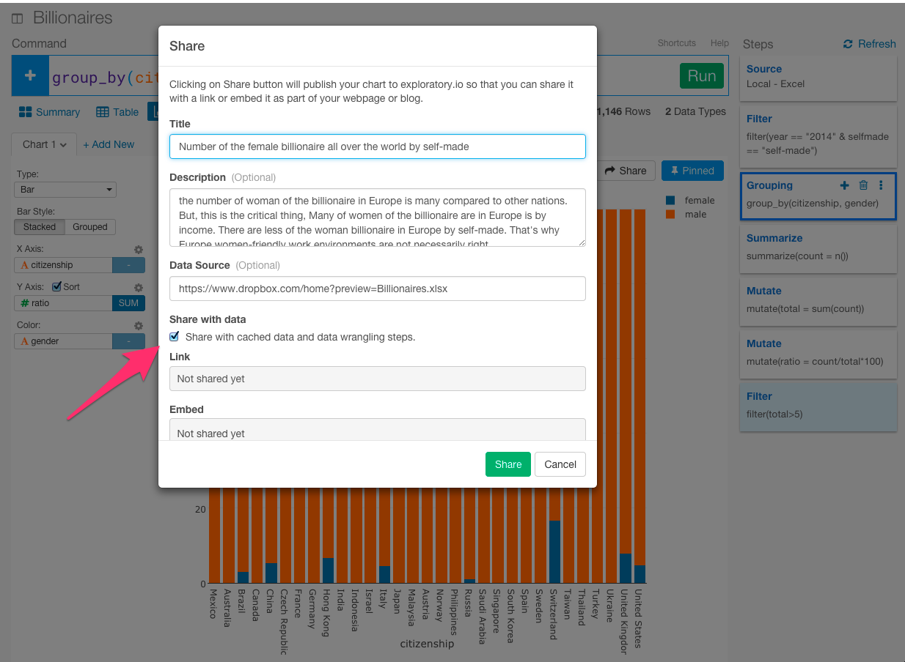

#Excel and Tabelow are dead. Billionaires data analysis on Exploratory, UI for R — Is Europe women-friendly work environments true ?

Do you have any idea about this spread sheet data ?

Actually, this is billionaires data all over the world which I downloaded from Forbes.com.

Anyway, you may come up with a few questions about this data now. For example,

- 1.Which country has the highest number billionaire ?
- 2.How come they become billionaires ?
- 3.Which are there more of, men or women?

Moreover, as some articles which I recently read in Japanese, Europe seems countries which have women-friendly work environments. If it is true, Has Europe many women billionaires?

Do, we have a product called Exploratory which can solve such some questions easily and quickly by analyzing data for you. I'm in this project's team in Silicon Valley. I'm grateful for being surrounded by great people who make me want to be better self-everyday. Exploratory Desktop provides an interactive and reproducible real data wrangling and analysis experience powered by R and visualization.

We released β version in May.

We excited that Hadley Wickham, the most famous person in R, retweeted our release.

<blockquote class="twitter-tweet" data-lang="ja">
<a href="https://twitter.com/KanAugust">@KanAugust</a> 1/ this could be a game changer. Especially with <a href="https://twitter.com/hashtag/teaching?src=hash">#teaching</a> <a href="https://twitter.com/hashtag/datascience?src=hash">#datascience</a> <a href="https://twitter.com/hashtag/science?src=hash">#science</a> highlights good/bad practices/data v quickly
&mdash; Stephen Newhouse (@s_j_newhouse) <a href="https://twitter.com/s_j_newhouse/status/729327017037053956">2016年5月8日</a></blockquote>

<blockquote class="twitter-tweet" data-lang="ja">
<a href="https://twitter.com/KanAugust">@KanAugust</a> Exploratory.io Love it!. Everyone with data should get it: students/teachers and all <a href="https://t.co/f4I6bCLxRi">https://t.co/f4I6bCLxRi</a>  <a href="https://twitter.com/hashtag/rstats?src=hash">#rstats</a>
&mdash; Stephen Newhouse (@s_j_newhouse) <a href="https://twitter.com/s_j_newhouse/status/729326373454680064">2016年5月8日</a></blockquote>

Here are many reactions around the world.

###Target Audience: Data Scientists who can do basic R or Python or People Who Know Just Enough R or SQL to Get by or Who are frustrating with Excel or Tabelow for analyzing data,

Before I begin, I’d like to clarify who my target audience is.In this tutorial, I’m targeting the third group I mentioned: people who know just enough R or SQL to get by or Who is frustrating with Excel or Tabelow for analyzing data. Examples of people who might fit in this category would be:

- Data Scientists or Analyst who can do basic R or Python.
- Data Analysts or Analyst Who are frustrating with Excel or Tabelow.
- Beginning developers who have completed basic SQL tutorials online.
- A Beginner who want to learn R but don't know how to learn for their research or static needs.
- Anyone who is interested in gender problem like working environments.

Anyway, let’s get started!

###Time Estimate: 10 minutes

If you go fast, this tutorial should take a bit over 5 minutes. If you go slow, it should take a bit over 10 minutes.

If you’re stuck, do any of the following:

- Comment on the comment box at the very bottom of this page.
- Email me at hidetaka.koh@gmail.com.
- Tweet me at [@SoccerKinki](https://twitter.com/SoccerKinki?lang=ja
)

####Preparing Data

To demonstrate, I’m going to use billionaires data from Forbes.com. I’ve shared it in EDF (Exploratory Data Format) [here]() so that you can quickly import with ‘Import Exploratory Data’ option. If you are interested in the original data you can download it from [here](https://www.dropbox.com/home?preview=Billionaires.xlsx) as well.

##Overview: Has Europe many women billionaires?

Let's reveal the question whether Europe women-friendly work environments are real or not by analyzing data for the introduction of Exploratory. After that, I state my impressions about Making the World Better for Working Women.

- STEP 1: Prepare Project before analyze
- STEP 2: Calculate ratio of billionaires for each country
- STEP 3: Remove outliers
- STEP 4: Is Europe women-friendly work environments real
- STEP 5: One more thing
- STEP 6: Sharing the Chart in Reproducible and Collaborative Way
- Finally: Making the World Better for Working Women

###STEP 1: Prepare Project Before Analyze

First of all, you can create projects from here.

You can import data. The dataset is [here](https://www.dropbox.com/home?preview=Billionaires.xlsx) so that You can download it.

####Summary View

Totally different,right ? Thanks to Summary View, we can quickly overview data which we can't recognize data in Excel by importing. For example, this citizenship column represents the number of billionaires for each country. As you can see, United States have the most billionaire all over the world. This self-made column represents how come they become billionaires. When you see gender column, you can understand men's billionaires is much more than women at first glance.

But, we can't analyze data precisely with the way it is now.　Why not?

Let's see year column and the name column.

The year column has data of the three years, 2014 and 2000 and 1996. And, We can see Abigail Johnson has "(3)" in the name column. That is because he was counted three times. In other words, Abigail Johnson was counted as one of the billionaires in 2014 and 2000 and 1996 in this data.What we want to know is information about billionaires in Europe now. So, we need to delete other data except 2014's year.

In such case, in contrast to Excel which I need to find where function like a filter is, Exploratory enables us to chose command from there or type code like SQL. Grammer enables you to express anything you want, that's why we can talk/write. Time to learn Grammar for Data Analysis, not tools like Excel or Tabelow!

Moreover, You can select the command from the column header dropdown list, which will generate a command like below.

Let's select ‘Filter’ from the column header dropdown list, which will generate a command like below because we want to filter 2014's data.

Let's specify that year is 2014 and press Run button.

Then, we can see only 2014's data in Summary View and the number of names become one from three.

In Chart View, we can intuitively understand data powered by visualization.

Let's assign X axis to citizenship and color axis to gender. That is because we want to see a graph of gender for each country. Blue color represents the female and orange color represents the male.

There are many billionaires and the ratio of men is overwhelmingly higher than the number of women in the world. By only this steps, Exploratory can make the chart so that we can understand data.

That is to say; Exploratory enable us to overview data easily and intuitively by just importing and realize the issues of data and fix it to analyze data.

That’s it for this step1! Not too bad, eh?

###STEP 2: Calculate the ratio of billionaires for each country

Note that to answer the question which is "Has Europe many women billionaires?", We have another problem. We don't know the ratio of billionaires between man and woman for each country because the height of each bar is different.

That's why We want to calculate the ratio of woman billionaires for each country

At First, We can quickly see the data as the table like Excel by going to Table view.

We can group citizenship and gender because we need to know the relationship between citizenship and gender by using 'group_by' command. You can construct this command from the column header menu. Click 'Group by' which will generate a command like below. Add 'gender' separating them by a comma. Here is the final command we want to run.

`group_by(citizenship, gender)`

You can confirm that citizenship and gender were grouped like below.

We need to divide each of the numbers of men and women by the total of men and women to calculate the ratio. That's why we want to create a column called 'count' which represents each of the numbers of males and females for each country. You can create the new column and aggregate the data by using 'summerize' command.

To make the command line interface work easier for anyone We have Context aware syntax suggestion which recommends a set of a list for function or column because Exploratory Desktop always check which column or function is good in this context like below.

So, you don't have to google the mean for functions which you don't know.

For example, here you will see a set of ‘aggregate’ functions that can be used in ‘summarize()’ command. If you are not familiar with R, as you can see, this ‘all’ function can be used to return TRUE if the condition is satisfied for all the rows or a group of rows. You can use the mean function in case of average or sum function in case of a total.

This Context aware syntax suggestion is a pretty powerful feature in Exploratory Desktop. Please take a look at [this post](https://blog.exploratory.io/context-aware-syntax-suggestion-d52519c55cf8#.n83k4wes0) for the detail.

Let's use 'n' function because we want to count in this case.

Look at Australia! They have four female and 25 male. To calculate the ratio of the woman, we need to divide 29 men and female by four women, don't we? Let's make a new column called total. To make a new column, we can use 'mutate'. Why do I need to use 'mutate', not 'summerize' like the previous case in this case? I have an answer for you. The difference is when we aggregate many rows in case of 'summerize' and make a new column with the same row in case of 'mutate'.

Let's 'mutate' command in this case because we want to left each row. And, we can use 'sum' function to calculate a total.

Let's create the ratio column because we can create the total column. When we divide count column by total, we can calculate the ratio.

Let's make 100 times because of 0.1379 and 0.8621.

That's why we understand Men and women of the ratio of the billionaire in each of the country.

13% of Billionaires is women and 86% of Billionaires is Men in Australia.

###STEP 3:Remove outliers

Let's go to chart view to understand data more intuitively by visualization.

Let's assign citizenship to X-axis and ratio to Y-axis and gender to color-axis.

the highest female billionaire ratio is Angola as you can see.

Then, Do you say that Angola is the country that has the highest female billionaire ratio all over the world?

Let's go to Table view to demystifying a situation.

A total number of billionaires and woman in Angola is only 1. In other words, There is not enough peripheral data because the number of population is too small. So, Let's filter the number of population.

There is only countries which have more than five the number of the population like above.

###STEP 4:Conculsion: Is Europe women-friendly work environments true ?

Let's go to chart view to understand data more intuitively by visualization.

High female billionaire ratio countries are European like Chile, Switzerland, Holland, Peru, Germany, France, Denmark as you can see.

Do you remember selfmade column that means how come they become billionares as I told before ? By using this column, let's see the diffrence between by income and by myself. So, I want to come back Filter step which assigned year at first.

Oh... When I back to filter step, Ratio in Y-axis come off and chart is diffrent from previous one. That is because ratio column doesn't exist at the time of filter step which is blue. That's why Pin button is here for this problem.

When you click the Pin button, the part which you filter in the last became blue. The chart is fixed to the last blue step. Then, When you come back to filter step in the first with this status, you can see like below.

Although we change the step now, we can update the past step while fixxing the chart to this blue step because I Pin this step. Then, let's filter only billionares by income.

Women of billionaire many countries by income are European countries like Australia, Chile, France, Germany, Spain, Sweaden, Switzerland as you can see.

And, let's filter only billionares by selfmade.

Wow! Many countries decrease suddenly. That is really interesting! Women of billionaire many countries by selfmade are only US and Switzerland. Many European countries like France and Geramany decrease now.

In conclusion, of course the number of woman of billionaire in Europe is many compared to other countries. But, this is critical thing, Many of women of billionaireis in Europe is by income. There are less of woman of billionaireis in Europe is by selfmade. That's why Europe women-friendly work environments is not necessary true.

##5. One more thing

This tutorial almost done. But, I want to show one more system for you. This is really interesting in term of technical point. And, you will understand why right step is.Although we can see the ratio per gender, in the next step, why don't see the ratio per industry ? Then, you can see by back to step for grouping and change just one command. So, let's go the step!

Although this chart is pinned to the last blue step, Exploratory can automatically caluculate and vizualize the data when you update grouping step.

##6. Sharing the Chart in Reproducible and Collaborative Way

この発見を記録したり、シェアしたいと思いませんか？　Noteというボタンを押してみましょう。

こんなふうにブログを書く感覚で簡単にデータ分析のレポートを書くことができます。データ分析するだけじゃなくて、他の仲間にも簡単にシェアすることもできます。

##Excel is dead. Why Exploratory is Exploratory?

この最初からの一連のステップをExcelですることを想像できるでしょうか？笑

The reason we at Exploratory get up every morning being excited is because we have a chance to address this decades old (if not hundreds) challenge that is slowing down our society to progress. We want Exploratory Desktop to be an environment where we can focus on analyzing the data, asking questions about the data, and wrangling with the data to explore possible answers, without much worrying about the processes or how to make it reproducible for later use. And of course, we want Exploratory Desktop to take care of making all the exploratory works reproducible behind the scene just in case we might need it later!

##7. Making the World Better for Working Women

留学先である、人材の流動性が高いシリコンバレーは実力主義のイメージが強いですが、仮にそうだとすると、次のデータはどう説明すればいいのでしょうか。[ソース](https://medium.com/diversify-tech/i-m-a-white-guy-in-silicon-valley-and-i-m-done-buying-the-meritocracy-myth-2cc0ef9f9b60#.lql629j9y)

1. シリコンバレーのトップ企業の管理職は78%が男性
2. エンジニアは85%が男性
3. 取締役レベルだと89%が男性
4. CEOレベルだと93%が男性
5. ベンチャー投資家だと96%が男性　

「シリコンバレー = 実力が全ての世界」とするのであれば、このデータからは「男性の実力 > 女性の実力」と結論付けるしかありません。だが実際には、シリコンバレーは男社会で(日本ほどではありませんが)、女性はキャリア面でハンデを負っています。

だから、ぼくの留学先であるシリコンバレーでは、女性エンジニアが少ないから、女性エンジニアを増やそうという動きが出てきています。ついこないだ、女性のコンピュータサイエンス教育によってジェンダーギャップを失くそうとしている[She++](http://www.sheplusplus.org/
)という団体がスタンフォード大学でカンファレンス的なのをしていたので見に行ったりしてました。They insisted “Maybe Womand don’t want to fall behind in their career when they’re pregnant. But She++ think learning to code is so much more practical. You can work remotely as a programmer too, while raising a kid.”

It’s challenging to be a working woman in Japan, my home country, too. The Economist recently presented their “glass-ceiling index,” which placed Japan among OECD countries with the largest gender gaps in their workplaces. For many Japanese women, returning to the workplace after having a child is often an insurmountable task. Japan should learn from She++, I think.

社会的に恵まれている人たちの中でも、実力主義を宗教のように信じている人たちは、実力の劣る人たちを見て「努力不足だ」と蔑むことはしても、男女の問題など、その後ろにある社会の不平等に気付かないことが多い気がします。完全な実力主義社会など存在しないことを、忘れてはいけません。

####FAQ

- 今回は、棒グラフしか使いませんでしたが、棒グラフ以外のグラフタイプもサポートしています。

- 今回は、ローカルのファイルをインポートしてきて分析しましたが、以下のように、GitHub、Google Analytics、Google Spread sheet、Mongo DB、MySQL、JSON REST APIなどのたくさんのデータベースから本当に簡単にデータをインポートしてきて分析することも可能です。

- 今回は使いませんでしたが、このソフトウェアはプログラミング言語「R」の上に開発されているので、使うコマンドや関数はRとほとんど同じになります。Rでできることは全てできます。Rは数学系のライブラリが充実しているので、クラスタリングやコホート分析や決定木分析などのような高度な統計や数学を応用してデータを分析していくことも可能です。

##Beta invitation is open

This is still our beta version and we’re just getting started. So there could be some places you might find unpolished, but we would love to hear what you think of it. You can sign up for the beta access from [this page](https://exploratory.io/
)

You can see our tutorial for Exploratory form [this page](http://docs.exploratory.io/tutorials/intro.html
)

[Introducing Exploratory Desktop — UI for R](https://blog.exploratory.io/introducing-exploratory-desktop-ui-for-r-895d94ef3b7b#.4dncgv1rt
) is good article, too!

Thanks for reading. I’d appreciate a click on the “Recommend” button at the end if you liked this article.

