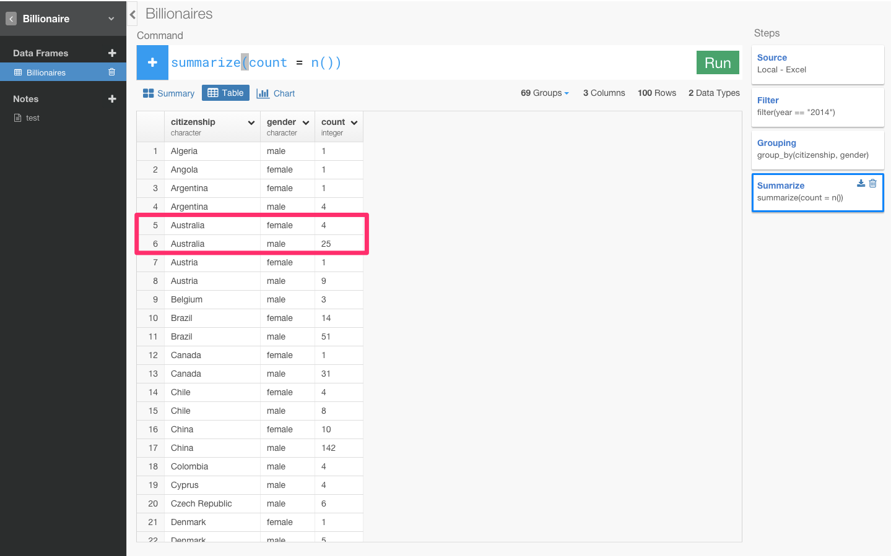

#Billionares data analysis on Exploratory, UI for R — Is Europe women-friendly work environments true ?

Do you have any idea about this spreed sheet data ? I don't think so.

Actually, this is billionares data all over the world which I downloaded from Forbes.com.

Anyway, From what country are there the most people in that billionares? How come they become billionares ? Which are there more of, men or women?

As some articles which I recently read as the below, Europe seems countries which have women-friendly work environments. If it is true, Has Europe many women billionares?

Do, we have a product called Exploratory which can solve such some questions easily by analyzing data for you. I'm in the project's team in Silicon Valley. I'm grateful for being surrounded by great people who make me want to be better self everyday. Exploratory Desktop provides an interactive and reproducible real data wrangling and analysis experience powered by R and visualization. In terms of technology, Exploratory provides interactive and reproducible environments for analyzing data by using NW.js (desctop application SDK on WebKit) and plotly.js on frontend of R.

We released β version in May.

We excited that Hadley Wickham, the most famaous person in R retweeted our release.

Here is reaction around the world.

###Target Audience: Data Scientists who can do basic R or Python or People Who Know Just Enough R or SQL to Get by
Before I begin or Who are frustlating with Excel or Tabelow for analyzing data, I’d like to clarify who my target audience is.

In this tutorial, I’m targeting the third group I mentioned: people who know just enough jQuery to get by or Who is frustlating with Excel or Tabelow for analyzing data. Examples of people who might fit in this category would be:

- Data Scientists who can do basic R or Python.
- Data Scientists Who are frustlating with Excel or Tabelow.
- Beginning developers who have completed basic SQL tutorials online.
- Beginner who want to learn R but don't know how to learn for their reserch or static needs.
- Anyone who are interestead in gender problem like working environments.

Anyways, let’s get started!

###Time Estimate: 15 minutes

If you go really fast, this tutorial should take a bit over 10 minutes. If you go slow, it should take a bit over 15 minutes.

If you’re stuck
If you’re stuck, do any of the following:

- Comment on the comment box at the very bottom of this page.
- Email me at hidetaka.koh@gmail.com.
- Tweet me at [@SoccerKinki](https://twitter.com/SoccerKinki?lang=ja
)

##Overview: Has Europe many women billionares?

Let's reveal the question whether Europe women-friendly work environments is true or not by analyzing data for introduction of Exploratory. After that, I state my impressions of data which I analyzed.

STEP 1: Prepare Project before analyze
STEP 2: Caluculate ratio of billionares for each countries
STEP 3: Remove outliers
STEP 4: Is Europe women-friendly work environments true
STEP 5: One more thing
STEP 6: Share by publishing Note.

Finally: My Observations

###STEP 1: Prepare Project before analyze

First of all, you can create projects from here.

You can import data.

####Summary View

Totally diffrent,right ? Thanks to Summary View, we can easily overview data which we can't recozinize in Excel data by importing. For example, this citizenship column represents the number of billionaires for each countries. As you can see, United States have the most billionaire all over the world at first glance. This selfmade column represents how come they become billionares. When you see gender column, you can understand men's billionaires is much more than women at first glance.

But, we can't analyze data precisely with the way it is now.　Why not ?

Let's see year column and name column.

Year column has data of the three years, 2014 and 2000 and 1996.
次に、nameカラムを見てみると、例えば、Akira Moriさん（六本木の森ビルの人）の最後には、3となっていますね。これは、3回カウントされているということです。つまり、このデータにおいてAkira Moriさんは、2014年、2000年、1996年どの年度のときにも億万長者としてカウントされていたことを意味します。

What we want to know is imformation about billionaires in Europe now. Then, when same people like Bill Gates were count many time, we can't analyze data precisely. So, we need to delete other data except 2014 year.

In such case, in contrast to Excel which I need to find where command like filter are, Exploratory enables us to chose functions from there or type command like SQL.

You can simply select command from the column header dropdown list, which will generate a command like below.

Let's select ‘Filter’ from the column header dropdown list, which will generate a command like below because we want to filtering 2014's data.

Let's specify that year is 2014 and press run button.

すると、yearが2014年だけになり、nameの回数も3から1になりましたね。

チャート画面では、ビジュアライゼーションによってデータをより直観的に理解することができるようになります。

それぞれの国ごとにおける性別のグラフを見たいので、X軸にcitizenship、colorにgenderを指定します。青はfemaleで、オレンジは、maleを表しています。

億万長者は、アメリカ市民がたくさんいて、男性の比率が圧倒的に高いことがひと目でわかりますね。
たったこれだけで、簡単なチャートを作ることができました。

つまり、Exploratoryでは、データをインポートしただけで、データの概要を直観的に理解することができるようになり、さらにデータ分析するうえで致命的なミスに気づいて、改善するところまでできました。

###STEP 2: Caluculate ratio of billionares for each countries

ただし、「今、ヨーロッパには、女性の億万長者も多かったりするのでしょうか？」という問いに答えるためには、このグラフだけではまだ解決できていない問題があります。それは、それぞれのバーの高さが違うため、それぞれの国における億万長者の男女の比率がわからないことなんです。

だから、それぞれの国における女性の比率を計算してだしてみたいと思います。

まず、テーブル画面に行くと、エクセルのような形で行形式でデータを見ることができます。

citizenship(どの国）とgender（男女）の関係について知る必要があるので両者をグルーピングします。グルーピングするには、Group_byを使うとできます。
先ほどと同じように、citizenshipの矢印の部分を押します。

Group byをクリックします。

すると、group_by(citizenship)と自動的に入力されます。これにgender（男女）を加えます。

citizenshipとgenderがグルーピングされていることを確認できますね。

さて、これから比率をだしていくためには男女のそれぞれの人数を男女の合計で割り算をする必要があります。だから、まず、それぞれの国でそれぞれの性別が何人いるかを表すcountって名前のカラムを作ります。カラムを統合して新しいカラムを作るときは、集計を意味するsummerizeという関数を使います。

カーソルを動かしながらこういったいろんなファンクションが用意されています。いつもこうやってどういうカラム名、ファンクションを出したらいいのかっていうのを絶えずこのアプリケーションがチェックしてるのでいつもそのときに適したリストがレコメンドされてでてくるんです。

例えば、この時に出てくるリストは、summerize（集計）のときにだけ使えるリストです。だから、ユーザーはどこで何のfunctionを使わないといけないかを覚えておく必要はないんです。また、右に関数の説明や例が表示されるので、関数の意味をGoogleで調べる必要もありません。平均を出したい場合は、mean関数を使えばいいし、合計を出したいならsum関数が使えます。今回はcountしたいので、そのときは、n関数を使います。

例えば、オーストラリアを見て下さい。femaleが4人で、maleが25人になっています。女性の比率を求めるには、男女の合計である29人を女性の4人で割ったらいいですよね？　だから、まず合計を意味するtotalカラムを作ってみましょう。新しいカラムを作るために、今回はmutateコマンドを使います。なぜ今回は、前回のようにsummerizeではなく、mutateなのか？

違いは、行をまとめるときは、さっきのようにsummerizeを使います。それに対し、mutateの場合は、この行のまま新しいカラムを作りたいときに計算をするときに使います。

今回は、それぞれの行を残しながら計算をしたいのでmutateを使います。そして、合計を出すsum関数を使います

合計を表すカラムが作れたので、次は、それを基に比率を表すratioというカラムを作りましょう。countカラムをtotalカラムで割り算をすると、比率を出すことができます。

0.1379や0.8621となっていてわかりにくいので、確率なので100倍します。

オーストラリアでは、億万長者のうち、約13%が女性で、約86%が男性ということです。
これで、それぞれの国における億万長者の男女の比率を計算して求めることができました。

###3. 意味のあるデータにする

テーブルだけだといまいちわからないので、もっとビジュアライズ化して直観的に理解できるようにチャート画面に行ってみましょう。
X軸にcitizenshipをY軸にratioをcolorにgenderを指定します。

女性の億万長者の比率が圧倒的に高い国は、Angola（アンゴラ）になっています。

では、Angola（アンゴラ）が本当に世界で一番女性の億万長者の比率が高い国であると言えるのでしょうか？

テーブル画面に行ってみましょう。

Angola（アンゴラ）の億万長者の合計人数は1人でその1人は女性になっています。つまり、母集団の数が少なすぎるため意味のあるデータではなくなっているのです。意味の有るデータにするために母集団の数にフィルタリングをかけましょう。ここでは、５人以上にフィルタリングします。

これで、totalが5人以上の国しか表示されなくなりましたね。

###4. ヨーロッパは女性が活躍しやすい社会なのか？

この状態で、チャート画面にもう一度行ってみます。

女性の億万長者が多い国は、順に見ていくと、チリ、スイス、オランダ、ペルー、ドイツ、フランス、デンマークとなっていて、確かにヨーロッパが多くなっていますね。

最初に少し述べた、どうやって億万長者になったかを表すselfmadeというカラムを覚えていますか？　このカラムを使って、相続で億万長者になった場合と、自力で億万長者になった国に違いがあるのか見てみましょう。なので、最初のyearを指定したFilterのステップに戻りたいと思います。

あれ、Filterのステップに戻るとY軸のratioが外れ、チャートの様子も変わってしまいましたね。これは、今青くなっているFilterのステップの時点では、ratioカラムは存在していないからなんです。この問題を防ぐために、Pinボタンというのがあります。

Pinというボタンを押すと、一番最後にfilterした部分が青くなりましたよね？この青くなった最後のステップのデータにこのチャートは固定されてます。この状態で、Filterのステップに戻ってみると・・・

今ここでSTEPを移動しましたけど、Pinしているので、この青くなっているSTEPにチャートを固定しながら、過去のSTEPを更新できるようになりました。
この状態で、相続で億万長者になった人だけにフィルタリングしたいと思います。

相続で億万長者になった女性の多い国は、オーストラリア、チリ、フランス、ドイツ、ブラジル、スペイン、スウェーデン、スイスとやっぱりヨーロッパが多くなっていますね。

次に、自力で億万長者になった人（selfmade）だけにフィルタリングしたいと思います。

なんか国が一気に減ってしまいましたね。自力で億万長者になった女性の多い国はスイスとアメリカが少しいるくらいになっています。さっきのフランスやドイツなどのヨーロッパを中心とした国々は消えてしまいましたね。

つまり、確かに、ヨーロッパには女性の億万長者の数は世界的に見ても多いです。しかし、ヨーロッパの女性の億万長者のほとんどが、親族からの相続なのです。自力で億万長者になった女性はあまりいません。だから、「ヨーロッパは女性が活躍しやすい社会」であるとは一概に言うことはできないかもしれません。

##5. おまけ

これでもうほとんど終わりなんですけど、最後に１つだけ見せたい機能があるんです。これは技術的にもけっこう面白い機能で、なんで右のようなステップになっているのかっていうのがもっと理解してもらえると思います。

いまはgender（性別）のratio（比率）を見てますけど、そうじゃなくてindustry（産業）ごとのratioを見てみたいと思いませんか？　そういうときは、groupingのSTEPに行って、ひとつ変えるだけですぐできるんです。じゃあGroupingに行ってみましょう。

このチャートは、一番最後の青くなっているところにピンされているんですけどいまGroupingを更新したらその結果を自動的に一番最後まで実行してチャートのデータを出すことができるんですよ。

##6. 記録する、シェアする

この発見を記録したり、シェアしたいと思いませんか？　Noteというボタンを押してみましょう。

こんなふうにブログを書く感覚で簡単にデータ分析のレポートを書くことができます。データ分析するだけじゃなくて、他の仲間にも簡単にシェアすることもできます。

この最初からの一連のステップをExcelですることを想像できるでしょうか？笑

Exploratoryでは、どんどん分析のためのステップ足していくこともできるし、途中で修正することもできます。どんなデータ分析をするときも、いつも指定の場所からコマンドを打つことができるので、Rの文法さえ覚えてしまえばこんなに簡単にいろんなデータをいろんな角度から見ていくことができるんです。

##7. 最後に

留学先である、人材の流動性が高いシリコンバレーは実力主義のイメージが強いですが、仮にそうだとすると、次のデータはどう説明すればいいのでしょうか。[ソース](https://medium.com/diversify-tech/i-m-a-white-guy-in-silicon-valley-and-i-m-done-buying-the-meritocracy-myth-2cc0ef9f9b60#.lql629j9y)

1. シリコンバレーのトップ企業の管理職は78%が男性
2. エンジニアは85%が男性
3. 取締役レベルだと89%が男性
4. CEOレベルだと93%が男性
5. ベンチャー投資家だと96%が男性　

「シリコンバレー = 実力が全ての世界」とするのであれば、このデータからは「男性の実力 > 女性の実力」と結論付けるしかありません。だが実際には、シリコンバレーは男社会で(日本ほどではありませんが)、女性はキャリア面でハンデを負っています。

だから、ぼくの留学先であるシリコンバレーでは、女性エンジニアが少ないから、女性エンジニアを増やそうという動きが出てきています。ついこないだ、女性のコンピュータサイエンス教育によってジェンダーギャップを失くそうとしている[She++](http://www.sheplusplus.org/
)という団体がスタンフォード大学でカンファレンス的なのをしていたので見に行ったりしてました。

社会的に恵まれている人たちの中でも、実力主義を宗教のように信じている人たちは、実力の劣る人たちを見て「努力不足だ」と蔑むことはしても、男女の問題など、その後ろにある社会の不平等に気付かないことが多い気がします。完全な実力主義社会など存在しないことを、忘れてはいけません。

####よくある質問

- 今回は、棒グラフしか使いませんでしたが、棒グラフ以外のグラフタイプもサポートしています。

- 今回は、ローカルのファイルをインポートしてきて分析しましたが、以下のように、GitHub、Google Analytics、Google Spread sheet、Mongo DB、MySQL、JSON REST APIなどのたくさんのデータベースから本当に簡単にデータをインポートしてきて分析することも可能です。

- 今回は使いませんでしたが、このソフトウェアはプログラミング言語「R」の上に開発されているので、使うコマンドや関数はRとほとんど同じになります。Rでできることは全てできます。Rは数学系のライブラリが充実しているので、クラスタリングやコホート分析や決定木分析などのような高度な統計や数学を応用してデータを分析していくことも可能です。

##興味を持っていただいた方、実際に触ってみたい方へ

Exploratoryは[こちら](http://docs.exploratory.io/tutorials/flight4.html
)からβ版の登録ができます。こちらがinviteを完了すると、ダウンロードできるようになります。

チュートリアルは[こちら](http://docs.exploratory.io/tutorials/intro.html
)から見ることができます。

英語が読める方は[Introducing Exploratory Desktop — UI for R](https://blog.exploratory.io/introducing-exploratory-desktop-ui-for-r-895d94ef3b7b#.4dncgv1rt
)もどうぞ

